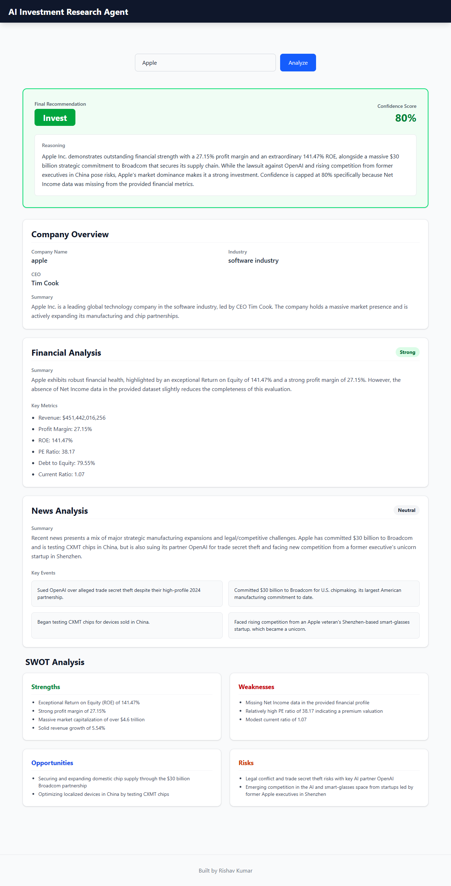
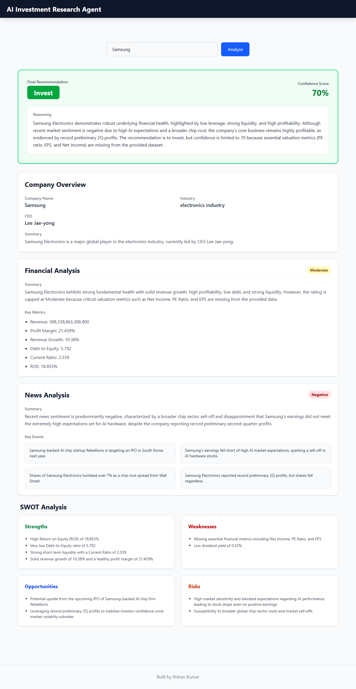
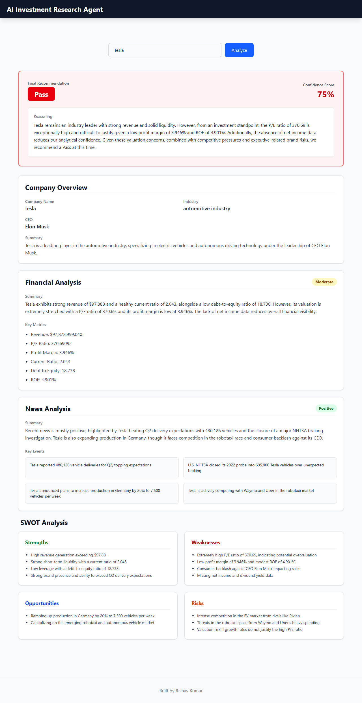

# AI Investment Research Agent

🚀 **Live Demo**: [https://ai-investment-research-agent-frontend.onrender.com/](https://ai-investment-research-agent-frontend.onrender.com/)
## 1. Overview
AI Investment Research Agent is a web application that helps users evaluate publicly listed companies using Artificial Intelligence. The application gathers company information, financial metrics, and recent news from multiple sources, then uses Gemini through LangChain to generate a structured investment recommendation with supporting reasoning.

## 2. How to Run

Clone the repository:
```bash
git clone https://github.com/Rishavrk25/AI-Investment-Research-Agent.git
```

### Backend Setup
```bash
cd backend
npm install
```

Create a `.env` file in the `backend` directory and add the following keys:
```env
PORT=5000
NEWS_API_KEY=your_news_api_key
GEMINI_API_KEY=your_gemini_api_key
MONGO_URI=your_mongodb_connection_string
```

Run the backend server:
```bash
npm start
```
*(You can also use `npm run dev` if you have nodemon installed)*

### Frontend Setup
```bash
cd frontend
npm install
```

Create a `.env` file in the `frontend` directory:
```env
VITE_BACKEND_API=http://localhost:5000/api
```

Run the frontend server:
```bash
npm run dev
```

## 3. How it Works
The application follows a structured, multi-layer architecture to gather data and generate insights.

**React (Frontend)**  
↓  
**Express (Backend API)**  
↓  
**Report Service** (Orchestrator)  
↓  
**Company Service** | **Finance Service** | **News Service** (Data Gatherers)  
↓  
**Research Object** (Aggregated Data)  
↓  
**LangChain** (Prompt Management & Structure)  
↓  
**Gemini** (LLM Analysis)  
↓  
**Structured Output** (JSON)  
↓  
**Frontend Render**

- **Frontend**: A minimal, responsive React UI built with Vite and Tailwind CSS.
- **Backend API**: An Express server that exposes an `/api/analyze` endpoint.
- **Services**: Dedicated services fetch live data from Wikidata (Company), Yahoo Finance (Finance), and NewsAPI (News).
- **LangChain + Gemini**: LangChain structures the prompt and enforces a strict JSON output schema from the Gemini model, ensuring the UI always receives predictable data.

## 4. Key Decisions & Trade-offs

- **Why LangChain?**  
  Used LangChain for prompt management and enforcing structured outputs instead of calling the Gemini SDK directly. This ensures reliable JSON parsing.
- **Why separate services?**  
  Each data source has its own service (Finance, News, Company), making the system modular, easier to maintain, and highly testable.
- **Why structured output?**  
  Makes frontend rendering significantly easier and avoids manual text parsing or hallucinated UI formats.
- **Why MongoDB caching?**  
  Implemented MongoDB to cache generated reports so they survive server restarts and spin-downs (unlike in-memory caching).
- **What was left out?**  
  To keep the scope focused on AI evaluation, the following features were intentionally excluded:
  - No user authentication
  - No historical stock analysis or charting
  - No technical indicators
  - No portfolio management
  - No live streaming prices

## 5. Example Runs

### Apple
  
**Recommendation**: Invest

### Samsung
  
**Recommendation**: Pass

### Tesla
  
**Recommendation**: Invest


## 6. Future Improvements
- Historical stock price analysis
- Portfolio comparison
- Watchlist integration
- Multi-company comparison
- PDF report export
- Better news sentiment analysis
- User authentication
